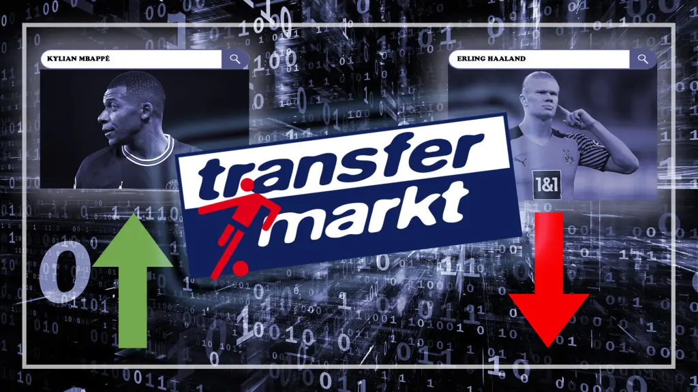
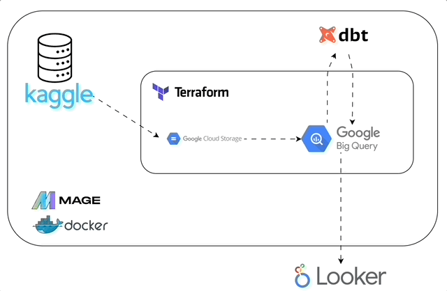
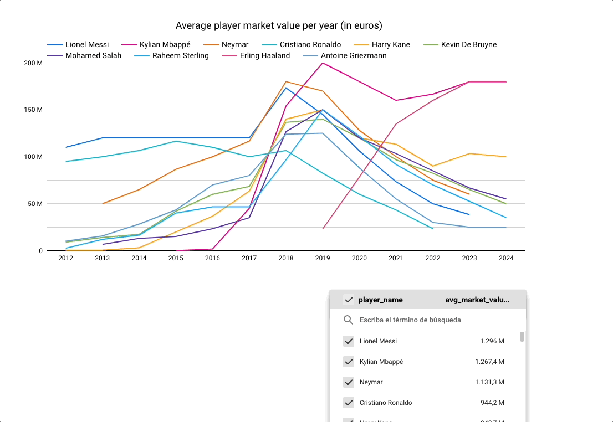

# ⚽ Football Transfermarkt Data Pipeline

## 📋 Table of contents
- [Introduction](#📖-introduction)
- [Problem description](#❓-problem-description)
- [Architecture Overview](#🏗️-architecture-overview)
    - [Data source](#📥-data-source)
    - [Data Ingestion](#📥-data-ingestion)
    - [Data Storage](#💾-data-storage)
    - [Transformations](#🔄-transformations)
- [Dashboard](#📊-dashboard)
- [Usage](#🔧-usage)

## 🏗️ Architecture

## 📖 Introduction

This repository represents my final project for the [Data Engineer Zoomcamp](https://github.com/DataTalksClub/data-engineering-zoomcamp). It aims to analyze a large dataset of football data scraped from the page [transfermarkt.es](https://www.transfermarkt.es/). 

## ❓ Problem Description

The project aims to answer several questions regarding players and their statistics. The focus is on market value, goals, and assists that players have accumulated over the years of their football careers.

## 🏗️ Architecture Overview

We use 🧙[Mage](https://www.mage.ai/) as an orchestrator for the whole pipeline, mounted inside a 🐳Docker container.

### 📥 Data Source

Data is inside a Kaggle [dataset](https://www.kaggle.com/datasets/davidcariboo/player-scores), and consists in 9 csv files:

- apearances.csv (124.22 MB)
- club_games.csv (8.45 MB)
- clubs.csv (96.06 MB)
- competitions.csv (7.47 MB)
- game_events.csv (75.46 MB)
- game_lineups.csv (244.38 MB)
- games.csv (19.88 MB)
- player_valuations.csv (15.8 MB) 
- players.csv (10.33 MB)

### 📥 Data Ingestion

- Batch: for the data ingestion we use the [Kaggle API](https://github.com/Kaggle/kaggle-api) to extract all 9 CSV files into a 🧙Mage block to prepare it for the data lake.
- Batch: for the data warehouse, we use 🧙Mage to download the data from the Google Cloud Storage bucket and prepare it for loading.

### 💾 Data Storage

Both the data lake and the data warehouse are managed by Terraform as a way to learn IaC.

- Google cloud storage: a Google Cloud Storage bucket was created using Terraform. Data is store as Parquet files to reduce memory consumption. All datasets were stored as whole file, except for game_lineups, wich was partitioned by year and month.
- Big query: a BigQuery database was created using terraform.

### 🔄 Transformations

We use [dbt cloud](https://www.getdbt.com/product/dbt-cloud) to manage all the transformations of the data inside the data warehouse. We clean and join the apearances and the player_valuations files to get the aggregations by year of the statistics that we care about.

## 📊 Dashboard

> [!WARNING]  
> Since i was using the free credits of Google Cloud, all the information was deleted and the report is no longer available.

Here is the [report](https://lookerstudio.google.com/reporting/affeeeed-5583-4da6-988a-06170c6d15cf). And here is a quick look at how it looks:

## 🔧 Usage 

You can refer to this [video]() where we provide an explicit tour of the project and how it works. 

If you prefer instructions, check the [README of the docs section](docs/README.md). 