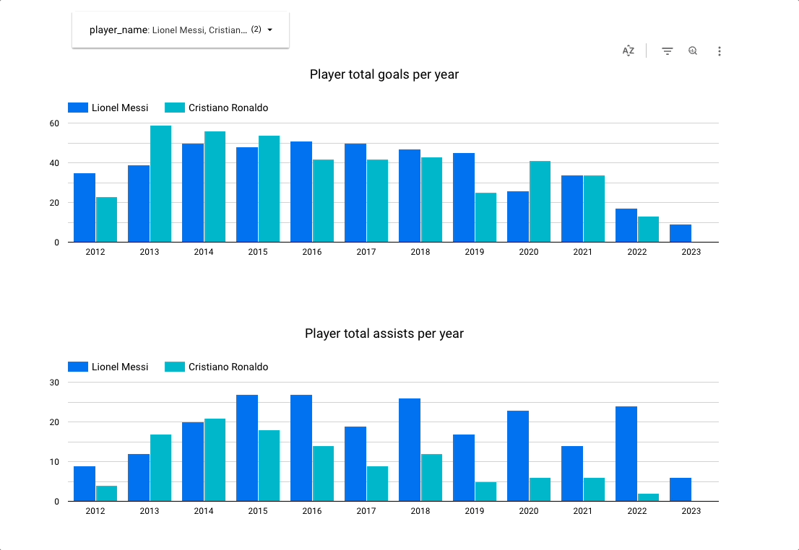

# Football Transfermarkt Data Pipeline

## Table of contents
- [Introduction](#introduction)
- [Problem description](#problem-description)
- [Architecture Overview](#architecture-overview)
    - [Data Ingestion](#data-ingestion)
    - [Data Storage](#data-storage)
    - [Transformations](#transformations)
- [Dashboard](#dashboard)
- [Usage](#usage)

## Architecture

## Introduction

This repository represents my final project for the [Data Engineer Zoomcamp](https://github.com/DataTalksClub/data-engineering-zoomcamp). It aims to analyze a large dataset of football data scraped from the page [transfermarkt.es](https://www.transfermarkt.es/). 

## Problem Description

The project aims to answer several questions regarding players and their statistics. The focus is on market value, goals, and assists that players have accumulated over the years of their football careers.

## Architecture Overview

We use [Mage](https://www.mage.ai/) as an orchestrator for the whole pipeline, mounted inside a Docker container.

### Data Source

Data is inside a Kaggle [dataset](https://www.kaggle.com/datasets/davidcariboo/player-scores), and consists in 9 csv files:

- apearances.csv (124.22 MB)
- club_games.csv (8.45 MB)
- clubs.csv (96.06 MB)
- competitions.csv (7.47 MB)
- game_events.csv (75.46 MB)
- game_lineups.csv (244.38 MB)
- games.csv (19.88 MB)
- player_valuations.csv (15.8 MB) 
- players.csv (10.33 MB)

### Data Ingestion

- Batch: for the data ingestion we use the [Kaggle API](https://github.com/Kaggle/kaggle-api) to extract all 9 csv files into a mage block to prepare it for the data lake.
- Batch: for the data warehouse, we use mage to download the data from the google cloud storage bucket and prepare it for the load.

### Data Storage

Both the data lake and the data warehouse where managed by Terraform as a way to learn IaC.

- Google cloud storage: a google cloud storage bucket was created using terraform. Data were store has parque files in order to reduce memory consumption. All the datasets were store as a whole file, except game_lineups, wich was partitioned by year and month.
- Big query: a big query database was created using terraform.

### Transformations

We use [dbt cloud](https://www.getdbt.com/product/dbt-cloud) to manage all the transformations to the data inside the datawarehouse. We clean and join the apearances and the player_valuations files, in order to get the aggroupations by year of the statistics that we care about.

## Dashboard

> [!WARNING]  
> Since i was using the free credits of Google Cloud, all the information was deleted and the report is no longer available.

Here is the [report](https://lookerstudio.google.com/reporting/affeeeed-5583-4da6-988a-06170c6d15cf). And here is a quick look into how it looks:

## Usage 

You can refer to this [video]() where we do an explicit tour of the project and how it works. 

If you prefer instructions, go and check the [readme of the docs section](docs/README.md). 